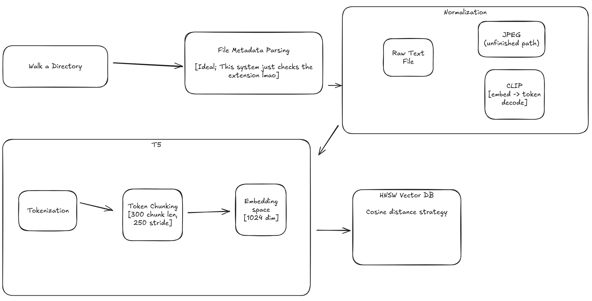

# Mono

A proof-of-concept semantic search for your filesystems

## Stack
- `Svelte`
- `candle-rs`
- `loco-rs` (`axum` + `sea_orm`)

See the `Cargo.toml` for details.

## Architecture

This app essentially wraps the `embed_db/examples/hnsw.rs` example.

From this model, we convert query requests into the embedding space with the same strategy used for the contents of text documents.
